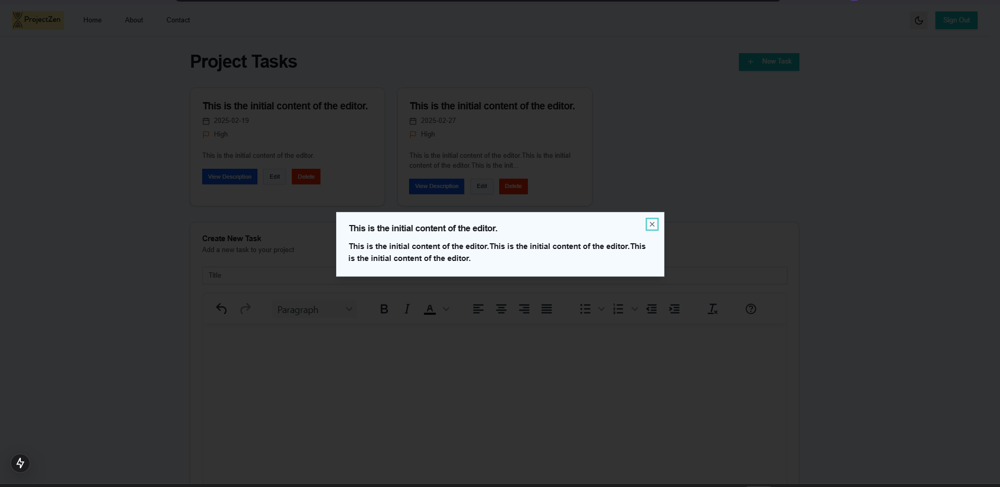

# Project Zen

**Project Zen** is a cutting-edge personal task management system designed to help you organize your daily tasks and projects effortlessly. Leveraging a comprehensive suite of modern web technologies, Project Zen provides a smooth full-stack experience with a strong focus on performance, scalability, and usability.

---

## Overview

Project Zen is meticulously crafted to empower users with an efficient and intuitive way to manage tasks and projects. Key features include:

- **Global State & Data Fetching:** Harness the power of Zustand for theme management and global state handling, paired with React Query (TanStack Query) for robust asynchronous data fetching and caching.
- **Task Management:** Seamlessly create, read, update, and delete tasks. Each task supports priority levels, due dates, and categorization under projects for better organization.
- **Responsive Dashboard:** Enjoy a dynamic interface with sidebar navigation, interactive forms, and a calendar view for scheduling and tracking deadlines.
- **Database & ORM:** Utilize PostgreSQL as the core database with Drizzle ORM to manage schema, optimize queries, and ensure type-safe interactions.
- **Project Management:** Organize tasks within projects featuring detailed views, statistical insights, and deadline tracking.
- **User Authentication:** Implement secure sign up, login, and logout functionalities with protected routes, ensuring data integrity and privacy.
- **Modern Styling:** Experience a clean, responsive design powered by Tailwind CSS, making the UI both attractive and mobile-friendly.

---

## Tech Stack

### Frontend

- **Next.js 15 (App Router):** For server-side rendering, optimized routing, and a seamless developer experience.
- **TypeScript:** Ensures robust type safety and enhanced code quality.
- **Tailwind CSS:** Provides a modern, utility-first approach to styling, ensuring responsive design out of the box.
- **Zustand:** Manages global state efficiently (e.g., theme toggling).
- **React Query (TanStack Query):** Streamlines data fetching, caching, and state synchronization.
- **ShadCN UI:** Supplies accessible, unstyled UI components to build a custom design system.

### Backend

- **Next.js API Routes:** Build RESTful APIs that integrate seamlessly with the frontend.
- **PostgreSQL:** Serves as the primary relational database.
- **Drizzle ORM:** Facilitates schema management and query optimization while maintaining type safety.
- **Neon:** Cloud-hosted PostgreSQL for reliable, scalable database hosting.

### Additional Libraries & Tools

- **Axios:** For efficient HTTP request handling.
- **Zod:** Provides schema validation to ensure robust data integrity.
- **dotenv:** Manages environment variables securely.
- **Nodemailer:** Enables email functionalities for user notifications and verifications.
- **bcryptjs:** Handles password hashing for secure authentication.
- **React Hook Form:** Simplifies form management and validation.
- **Day.js & date-fns:** Offer powerful utilities for date manipulation.
- **Various ShadCN UI Components:** Enhance the UI with a range of accessible and customizable components.

---

## Installation & Setup

1. **Clone the repository:**

   ```bash
   git clone https://github.com/MishraShardendu22/Project-Management.git
   cd Project-Management
   ```

2. **Install dependencies:**

   ```bash
   npm install
   ```

3. **Configure Environment Variables:**

   Create a `.env` file at the root of the project and add the required environment variables for database connection, authentication, email services, and more.

4. **Run the development server:**

   ```bash
   npm run dev
   ```

   The application will be available at [http://localhost:3000](http://localhost:3000).

5. **Build for production:**

   ```bash
   npm run build
   npm start
   ```

---

## Database Schema

Project Zen uses PostgreSQL with the following core tables:

- **Tasks:** Manages individual tasks with priority levels, due dates, descriptions, and completion statuses.
- **Categories:** Organizes tasks into meaningful groups for better tracking.
- **Projects:** Houses project-specific details including deadlines, descriptions, and associated tasks.
- **Users:** Handles user profiles, authentication details, and verification processes.

_(For a detailed view of the schema definitions, refer to the codebase.)_

---

## API Endpoints

Project Zen exposes a suite of RESTful APIs via Next.js API routes, enabling:

- **Categories:** Create, update, and delete task categories.
- **Tasks:** Perform full CRUD operations on tasks with filtering and categorization capabilities.
- **Authentication:** Handle user registration, login, logout, and email verification.
- **Projects:** Manage project lifecycle with complete CRUD support.

---

## Connect With Me

- **GitHub Profile:** [github.com/MishraShardendu22](https://github.com/MishraShardendu22)
- **Project Repository:** [Project-Management](https://github.com/MishraShardendu22/Project-Management)
- **Live Demo:** [Project Zen Live](https://project-management-internhsip-shardendu-mishra.vercel.app/)
- **Live Video:** [Project Zen Video](https://www.loom.com/share/17111c76016545f2b255316369e9defb?sid=67bd8ecb-f003-48e7-9db9-6ba5351e1437)

---

# Improvements
